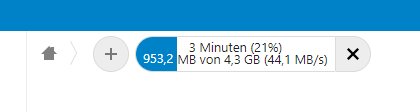

# Upload Details
**_DEPRECATED_:**
I worked with the Nextcloud-Team to bring this functionality into Core. As of Nextcloud 18 this app is no longer necessary. Simply hover over the Progressbar to show advanced details. Thanks to the Nextcloud-Team for helping me out

**Shows Upload Details (percent complete, current speed, ...) in Upload Progress Bar**

By default, the Nextcloud upload progress bar only shows an estimated time to completion. This App adds useful information like the current upload speed, completion in percent and uploaded/total file size.

### Screenshot:

